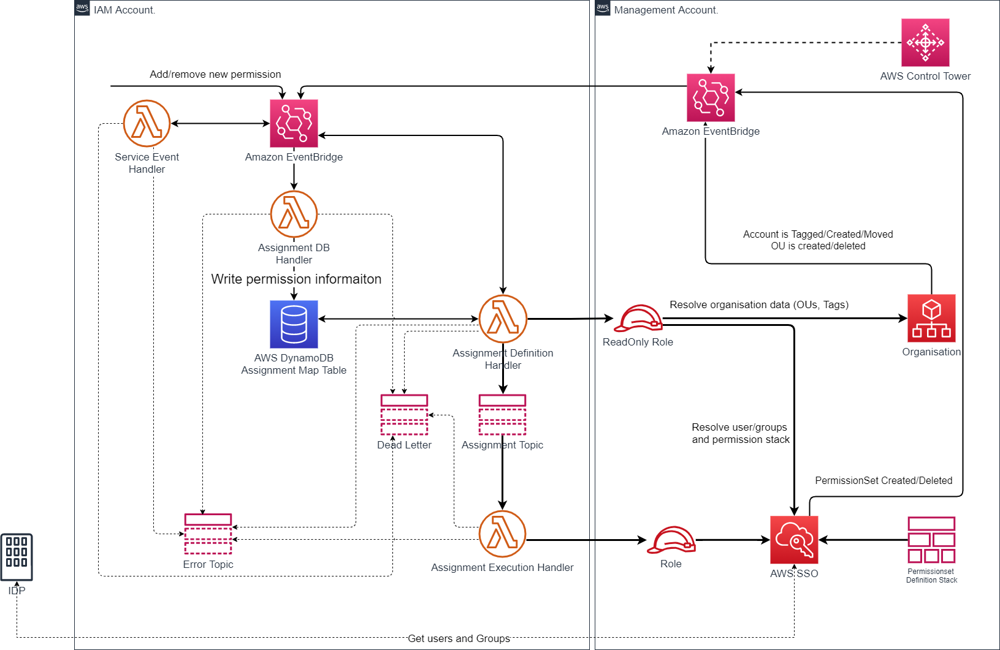
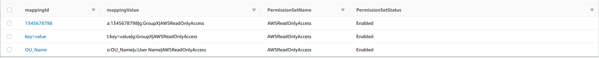

# Enterprise AWS SSO

## Architecture Overview



## Installation prerequisites

To install provided module following prerequisites needs to be satisfied:

- AWS CDK v2 CLI - <https://docs.aws.amazon.com/cdk/v2/guide/cli.html>
  - TLDR: `npm install -g aws-cdk`
- Docker - <https://docs.docker.com/get-docker/>
- requirements from `requirements.txt` file installed into your python environment
- At least 2 accounts:
  - AWS Organizations Management account
  - AWS account for Deployment and Execution
- Deployment and Execution can be separate AWS accounts if required.

## Deployment notes

1. Modify cdk.context.json with appropriate accounts information as well as variables and commit changes. At the bare minimum the following 4 parameters need to be changed:
    - *enterprise_sso_management_account_id*: AWS Account Id of the AWS Organization Management Account
    - *enterprise_sso_exec_account_id*: AWS Account Id where the application will be running in. Should NOT be the same as the AWS Organization management account.
    - *enterprise_sso_deployment_account_id*: AWS Account Id that will have the AWS CodePipeline pipeline deployed to. Can be the same as *enterprise_sso_exec_account_id*
    - *error_notifications_email*: Notification email for error messages

    **Make sure to commit these changes ot the local repository, or these changes will not propagate to AWS CodeCommit**

1. Set `AWS_DEFAULT_REGION` environment variables to the desired value
1. Bootstrap all AWS accounts using the new bootstrap style. More information [here](https://docs.aws.amazon.com/cdk/api/latest/docs/pipelines-readme.html#cdk-environment-bootstrapping)(you can skip *--profile* is you are using ENV variables for providing AWS access credentials). You can deploy this solution in multiple regions or only `us-east-1` bootstrap instead and deploy everything to a single region. Event bridge configuration and support pipelines stack related to AWS Organization and AWS SSO will always be deployed to `us-east-1` region, thus requires a bootstrap in that region.

    1. Bootstrap deployment account (`us-east-1`):

        ```sh
        env CDK_NEW_BOOTSTRAP=1 cdk bootstrap \
        --profile deployment_profile \
        --cloudformation-execution-policies arn:aws:iam::aws:policy/AdministratorAccess \
        aws://111111111111/us-east-1
        ```

    1. If deploying to another region (set in the `AWS_DEFAULT_REGION` variable), bootstrap deployment account for the additional region:

        ```sh
        env CDK_NEW_BOOTSTRAP=1 cdk bootstrap \
        --profile deployment_profile \
        --cloudformation-execution-policies arn:aws:iam::aws:policy/AdministratorAccess \
        aws://111111111111/$AWS_DEFAULT_REGION
        ```

    1. Bootstrap management account:

        ```sh
        env CDK_NEW_BOOTSTRAP=1 cdk bootstrap \
        --profile management_profile \
        --cloudformation-execution-policies arn:aws:iam::aws:policy/AdministratorAccess \
        --trust 11111111111 \
        aws://222222222222/us-east-1
        ```

        ```sh
        env CDK_NEW_BOOTSTRAP=1 cdk bootstrap \
        --profile management_profile \
        --cloudformation-execution-policies arn:aws:iam::aws:policy/AdministratorAccess \
        --trust 11111111111 \
        aws://222222222222/$AWS_DEFAULT_REGION
        ```

    1. Bootstrap iam account (can be skipped if using 2 accounts model):

        ```sh

        env CDK_NEW_BOOTSTRAP=1 cdk bootstrap \
        --profile iam_profile \
            --cloudformation-execution-policies arn:aws:iam::aws:policy/AdministratorAccess \
        --trust 11111111111 \
        aws://3333333333333/$AWS_DEFAULT_REGION
        ```

1. Setup environment variables for accessing the deployment AWS account.
1. For an initial deployment, the initial_deployment.py script can be used, which creates a codecommit repository and pushes the code using settings from `cdk.context.json`.
    1. Install requirements from `initial-deploy-requirements.txt`
    1. Make sure changes to `cdk.context.json` are committed to the local repository.
    1. Execute `python3 initial_deployment.py`
        1. the `--no-history` flag can be used to not preserve git history if desired.
1. Once the repository exists and the code is pushed to it, execute `cdk deploy EnterpriseAWSSSOPipelineStack`. For all further changes, the newly created pipeline will be triggered for commits to the `main` branch.
1. Now all the manual deployment steps have been completed. AWS CodePipeline will deploy everything else automatically. You can track the progress from the deployment AWS Account by opening up the AWS Codepipeline console.

## Usage

This solution is event driven, utilizing a custom AWS EventBridge EventBus in the IAM account (the name of the bus is defined in the `target_event_bus_name` context variable in `cdk.context.json`). The following following events are supported:

### Create/Remove AWS SSO records

In order to manipulate AWS SSO assignments following event structure is used:

```json
{
    "source": "permissionEventSource",
    "detail": {
        "permissions": [
            {
                "ActionType": "Add", //Possible values "Add" or "Remove"
                "PermissionFor": "OrganizationalUnit", //Possible values "OrganizationalUnit"|"Account"|"Tag"|"Root"
                "OrganizationalUnitName": "OU_Name",
                "AccountNumber": 30010047,
                "Tag": "key=value",
                "GroupName": "GroupX",
                "UserName": "User Name",
                "PermissionSetName": "AWSReadOnlyAccess"
            }
        ]
    }
}
```

Based on the type of user entity (user or group) and permission abstraction. Different fields are used.
Examples:

#### Add record for user and a single account

```json
{

    "source": "permissionEventSource",
    "detail": {
        "permissions": [
            {
                "ActionType": "Add",
                "PermissionFor": "Account",
                "AccountNumber": 1234567890123,
                "UserName": "User Name",
                "PermissionSetName": "AWSReadOnlyAccess"
            }
        ]
    }

}
```

#### Add record for Organization and group. It's important to use OU name and not not the ID

```json
{

    "source": "permissionEventSource",
    "detail": {
        "permissions": [
            {
                "ActionType": "Add",
                "PermissionFor": "OrganizationalUnit",
                "OrganizationalUnitName": "OU_Name",
                "GroupName": "GroupX",
                "PermissionSetName": "AWSReadOnlyAccess"
            }
        ]
    }

}
```

#### Remove record for Tag and group

```json
{

    "source": "permissionEventSource",
    "detail": {
        "permissions": [
            {
                "ActionType": "Remove",
                "PermissionFor": "Tag",
                "Tag": "key=value",
                "GroupName": "GroupX",
                "PermissionSetName": "AWSReadOnlyAccess"
            }
        ]
    }

}
```

Events mentioned above will create records in DynamoDB, and trigger corresponding action in AWS SSO.
DynamoDB acts as a single point of truth, for any following actions. Having such records in DynamoDB will allow automatic assignment/removal of AWS SSO permission when moving accounts between OU as well as creating new accounts in OU.

### DB Records example



## Limitations

1. As of current state does not support nested OU's
1. Testing is currently limited
1. Support of ResourceTagged AWS Organization is removed for now due to multiple processing options

## Testing prerequisites

Python tests are executed using pytest package.
Make sure that folder ` ./src/layers/ ` is added to `PYTHONPATH` variable as test are depended on the code fined in lambda layers.

To execute test pass the test pass the test file to the pytest:

```bash
python3 -m pytest -v src
```

This will load mock classes from the layers folder and run complete test suite.

## Additional Info

This project is best executed from a virtualenv.

To manually create a virtualenv on MacOS and Linux:

```bash
python3 -m venv .venv
```

After the init process completes and the virtualenv is created, you can use the following
step to activate your virtualenv.

```bash
source .venv/bin/activate
```

If you are a Windows platform, you would activate the virtualenv like this:

```cmd
% .venv\Scripts\activate.bat
```

Once the virtualenv is activated, you can install the required dependencies.

```bash
pip install -r requirements.txt
```

At this point you can now synthesize the CloudFormation template for this code.

```bash
cdk synth
```

## Useful commands

- `cdk ls` list all stacks in the app
- `cdk synth` emits the synthesized CloudFormation template
- `cdk deploy` deploy this stack to your default AWS account/region
- `cdk diff` compare deployed stack with current state
- `cdk docs` open CDK documentation

## Security

See [CONTRIBUTING](CONTRIBUTING.md#security-issue-notifications) for more information.

## License

This library is licensed under the MIT-0 License. See the LICENSE file.
